# Diagramme : Processus opérationnel — Agents Copilot Studio Light

---
config:
  layout: dagre
---

Ce diagramme illustre le cycle de vie d'un agent Copilot Studio Light depuis la conception jusqu'à la publication et la mise en production. Les étapes correspondent à des pages détaillées dans ce répertoire.

```mermaid
---
config:
  layout: dagre
---
flowchart LR
 subgraph PH1["Phase 1 - Conception dans Microsoft 365 Copilot"]
        U1["1. Utilisateur Microsoft 365\n(créer un agent depuis Copilot Chat)"]
        A2["2. Agent Copilot Studio Light\n(modèle d’agent déclaratif)"]
  end
    U1 -- Création et test de l’agent --> A2
    A2 -- Feedback et amélioration continue\ndes instructions --> U1
    A2 --> E3["3. Export de l’agent au format ZIP\n(depuis l’interface Copilot / Studio Light)"]
    E3 --> F4["4. Soumission du fichier ZIP\npar l’utilisateur via Microsoft Forms\n(formulaire de déclaration d’agent)"]
    F4 --> P5["5. Flux Power Automate\n(création/maj dans SharePoint\n+ courriels à l’utilisateur et aux admins)"]
    P5 --> SP5["Liste SharePoint\n(Catalogue des agents)"]
    SP5 --> ADM6["6. Administrateurs M365 / CoE\nrévisent et complètent les informations\n(métadonnées, conformité, gouvernance)"]
    ADM6 --> SP5
    ADM6 --> G7["7. Repo GitHub (modèle d’agent)\ncréation ou mise à jour :\nREADME, fiche agent, instructions,\nCHANGELOG, fichiers de configuration"]
    G7 --> I8["8. Ajout du bloc d’instructions\nstandard de l’entreprise\n(aux instructions initiales)"]
    I8 --> PUB9["9. Publication de l’agent\ndepuis le Centre d’administration M365\n(menu Applications intégrées)"]
    PUB9 --> P10["10. Mise à jour de la liste SharePoint\navec les détails de l’agent publié\n+ Power Automate : courriel à l’utilisateur"]
    P10 --> SP5
```

Pages détaillées (liens relatifs) :
- 1. docs/governance/copilot-studio-light/step-1-user-creation.md
- 2. docs/governance/copilot-studio-light/step-2-agent-model.md
- 3. docs/governance/copilot-studio-light/step-3-export-zip.md
- 4. docs/governance/copilot-studio-light/step-4-forms-submission.md
- 5. docs/governance/copilot-studio-light/step-5-power-automate.md
- 6. docs/governance/copilot-studio-light/step-6-admin-review.md
- 7. docs/governance/copilot-studio-light/step-7-github-repo.md
- 8. docs/governance/copilot-studio-light/step-8-standard-instructions.md
- 9. docs/governance/copilot-studio-light/step-9-publication.md
- 10. docs/governance/copilot-studio-light/step-10-post-publish.md
