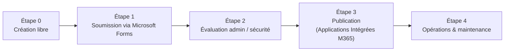

# Diagramme : Processus opérationnel — Agents Copilot Studio Light

Ce document contient un diagramme Mermaid qui illustre les étapes du processus opérationnel (point 3) et référence les pages détaillées dans ce répertoire.

Pages détaillées (liens relatifs dans le dépôt)
- Étape 0 — Création libre  
  docs/governance/copilot-studio-light/step-0-creation.md  
  https://github.com/ngeorgeault/copilot-agent-light-template/blob/main/docs/governance/copilot-studio-light/step-0-creation.md

- Étape 1 — Soumission via Microsoft Forms  
  docs/governance/copilot-studio-light/step-1-submission.md  
  https://github.com/ngeorgeault/copilot-agent-light-template/blob/main/docs/governance/copilot-studio-light/step-1-submission.md

- Étape 2 — Évaluation admin / sécurité  
  docs/governance/copilot-studio-light/step-2-evaluation.md  
  https://github.com/ngeorgeault/copilot-agent-light-template/blob/main/docs/governance/copilot-studio-light/step-2-evaluation.md

- Étape 3 — Publication (Integrated App)  
  docs/governance/copilot-studio-light/step-3-publication.md  
  https://github.com/ngeorgeault/copilot-agent-light-template/blob/main/docs/governance/copilot-studio-light/step-3-publication.md

- Étape 4 — Opérations & maintenance  
  docs/governance/copilot-studio-light/step-4-operations.md  
  https://github.com/ngeorgeault/copilot-agent-light-template/blob/main/docs/governance/copilot-studio-light/step-4-operations.md
