```mermaid
---
config:
  layout: dagre
---
flowchart LR
 subgraph PH1["Phase 1 - Conception dans Microsoft 365 Copilot"]
        U1["1. Utilisateur Microsoft 365\n(créer un agent depuis Copilot Chat)"]
        A2["2. Agent Copilot Studio Light\n(modèle d’agent déclaratif)"]
  end
    U1 -- Création et test de l’agent --> A2
    A2 -- Feedback et amélioration continue\ndes instructions --> U1
    A2 --> E3["3. Export de l’agent au format ZIP\n(depuis l’interface Copilot / Studio Light)"]
    E3 --> F4["4. Soumission du fichier ZIP\npar l’utilisateur via Microsoft Forms\n(formulaire de déclaration d’agent)"]
    F4 --> P5["5. Flux Power Automate\n(création/maj dans SharePoint\n+ courriels à l’utilisateur et aux admins)"]
    P5 --> SP5["Liste SharePoint\n(Catalogue des agents)"]
    SP5 --> ADM6["6. Administrateurs M365 / CoE\nrévisent et complètent les informations\n(métadonnées, conformité, gouvernance)"]
    ADM6 --> SP5
    ADM6 --> G7["7. Repo GitHub (modèle d’agent)\ncréation ou mise à jour :\nREADME, fiche agent, instructions,\nCHANGELOG, fichiers de configuration"]
    G7 --> I8["8. Ajout du bloc d’instructions\nstandard de l’entreprise\n(aux instructions initiales)"]
    I8 --> PUB9["9. Publication de l’agent\ndepuis le Centre d’administration M365\n(menu Applications intégrées)"]
    PUB9 --> P10["10. Mise à jour de la liste SharePoint\navec les détails de l’agent publié\n+ Power Automate : courriel à l’utilisateur"]
    P10 --> SP5
```

# Diagramme : Processus opérationnel — Agents Copilot Studio Light

Ce diagramme illustre le cycle de vie d'un agent Copilot Studio Light depuis la conception jusqu'à la publication et la mise en production. Il met en évidence les rôles (utilisateur, administrateurs, CoE), les artefacts produits (ZIP, SharePoint, repo GitHub) et le flux opérationnel automatisé (Power Automate).

Utilisez les pages liées ci‑dessous pour accéder aux descriptions détaillées de chaque étape, aux checklists et aux recommandations de sécurité.

Descriptions par étape (liens vers les pages détaillées)

1.  Utilisateur : Création dans Microsoft 365 Copilot  
    - Description : L'utilisateur métier conçoit et teste l'agent via Copilot Studio Light. Il définit objectif, instructions, exemples et configure les sources de connaissance.  
    - Détails et checklist : docs/governance/copilot-studio-light/step-1-user-creation.md

2.  Agent Copilot Studio Light (modèle déclaratif)  
    - Description : Structure déclarative de l'agent (instructions, prompts, configuration RAG, connecteurs). Respect des bonnes pratiques de Copilot Studio Guidance.  
    - Détails et checklist : docs/governance/copilot-studio-light/step-2-agent-model.md

3.  Export de l'agent au format ZIP  
    - Description : Export du package agent (.zip) contenant manifest, instructions et métadonnées pour soumission.  
    - Détails et checklist : docs/governance/copilot-studio-light/step-3-export-zip.md

4.  Soumission via Microsoft Forms  
    - Description : L'auteur soumet le ZIP et les métadonnées via le formulaire officiel. Le formulaire déclenche l'ingestion automatisée.  
    - Détails et checklist : docs/governance/copilot-studio-light/step-4-forms-submission.md

5.  Flux Power Automate (ingestion & notifications)  
    - Description : Le flux enregistre le ZIP dans la bibliothèque, crée l'item en liste et lance le workflow d'approbation.  
    - Détails et checklist : docs/governance/copilot-studio-light/step-5-power-automate.md

6.  Revue par les administrateurs M365 / CoE  
    - Description : Revue de sécurité et conformité, classification et décision de publication.  
    - Détails et checklist : docs/governance/copilot-studio-light/step-6-admin-review.md

7.  Repo GitHub : modèle d'agent & documentation  
    - Description : Pour les agents approuvés, création/mise à jour d'un repo modèle contenant la fiche agent, README, changelog et artefacts.  
    - Détails et checklist : docs/governance/copilot-studio-light/step-7-github-repo.md

8.  Ajout du bloc d'instructions standard de l'entreprise  
    - Description : Insertion du bloc d'instructions corporate (sécurité, limites, contacts) avant publication.  
    - Détails et checklist : docs/governance/copilot-studio-light/step-8-standard-instructions.md

9.  Publication depuis le Centre d'administration M365  
    - Description : Publication via Applications intégrées, définition de la portée, labels et DLP.  
    - Détails et checklist : docs/governance/copilot-studio-light/step-9-publication.md

10. Post-publication : Mise à jour & suivi  
    - Description : Mise à jour du catalogue SharePoint, notifications, suivi d'usage et revues périodiques.  
    - Détails et checklist : docs/governance/copilot-studio-light/step-10-post-publish.md
